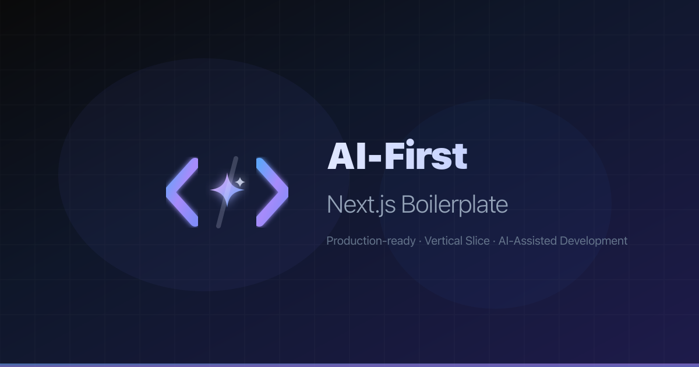

<div align="center">



<br />
<br />

# 🎩 Vibe Code Stack For CEOs

### You're the CEO. Your AI agents are the engineering org.

**Stop prompting. Start delegating.** The full-stack monorepo where Claude Code, Cursor, Gemini CLI, Kiro, Copilot, and Windsurf all read **one company handbook** — and ship **identical, production-grade code** on the first try.

[](https://github.com/NoahDuongMaster/ai-first-nextjs-boilerplate/stargazers)
[](https://github.com/NoahDuongMaster/ai-first-nextjs-boilerplate/network/members)
[](https://nextjs.org)
[](https://typescriptlang.org)
[](https://opensource.org/licenses/MIT)

[⚡ Quick Start](#-quick-start) · [😤 The Problem](#-the-problem) · [🏢 How It Works](#-how-it-works--the-ceo-model) · [🔥 Battle-Tested](#-battle-tested-by-26-ai-agents) · [⭐ Star History](#-star-history)

</div>

---

## 😤 The Problem

You open Cursor, type *"create a user profile page"*, and get:

- A file in the wrong folder
- `useState` for form fields instead of react-hook-form
- Raw `fetch()` instead of your HTTP client
- `console.log` everywhere
- No Zod validation, no error boundaries, no types

**You hired a 10x engineer and got an intern with amnesia.** Every prompt starts from zero. Every tool has its own opinions. You spend more time reviewing AI slop than you'd spend writing the code yourself.

That's not vibe coding. That's babysitting.

---

## 🏢 How It Works — the CEO Model

**A real company doesn't re-explain its culture to every new hire. It hands them the handbook.**

This repo has one: [`AGENTS.md`](./AGENTS.md) — the emerging open standard for agent instructions (`CLAUDE.md` is a symlink, so every tool finds it). It defines the architecture, the naming laws, the testing rules, the fireable offenses. Every AI agent reads it before writing a single line.

```
        ┌─────────────────────────────────┐
        │   AGENTS.md  (the handbook)     │
        │   CLAUDE.md ──► symlink         │
        └───────────────┬─────────────────┘
      ┌────────┬────────┼────────┬─────────┐
      ▼        ▼        ▼        ▼         ▼
   Claude   Cursor   Copilot  Gemini   Windsurf
      └────────┴────────┴────────┴─────────┘
                       ▼
        ✅ identical, rule-compliant code
```

And because trust is good but gates are better, **nothing ships without passing the Five Gates**:

> **`typecheck` → `lint` → `test` → `build` → `audit`** — enforced locally by husky, enforced again in CI, and deploys are CI-gated with staging/production separation. If an agent (or a human) breaks a rule, the pipeline says no. Period.

**You review outcomes, not syntax. That's the whole product.**

---

## 📊 Why Developers Are Switching

<table>
<tr>
<th width="250"></th>
<th width="150" align="center"><code>create-next-app</code></th>
<th width="150" align="center"><code>t3-app</code></th>
<th width="200" align="center"><b>🎩 Vibe Code Stack For CEOs</b></th>
</tr>
<tr>
<td><b>AI understands your architecture</b></td>
<td align="center">-</td>
<td align="center">-</td>
<td align="center">One <code>AGENTS.md</code>, every agent</td>
</tr>
<tr>
<td><b>Vertical slice architecture</b></td>
<td align="center">-</td>
<td align="center">Partial</td>
<td align="center">Strict, ESLint-enforced</td>
</tr>
<tr>
<td><b>Full monorepo (3 apps + RPC backend)</b></td>
<td align="center">-</td>
<td align="center">-</td>
<td align="center">Turborepo, 8 workspaces</td>
</tr>
<tr>
<td><b>Type-safe end to end</b></td>
<td align="center">-</td>
<td align="center">tRPC</td>
<td align="center">Connect-RPC (Protobuf) + next-safe-action</td>
</tr>
<tr>
<td><b>CI-gated deploys (staging/prod)</b></td>
<td align="center">-</td>
<td align="center">-</td>
<td align="center">GitHub Environments + wrangler</td>
</tr>
<tr>
<td><b>Pre-commit AI code review</b></td>
<td align="center">-</td>
<td align="center">-</td>
<td align="center">Code Review Graph MCP</td>
</tr>
<tr>
<td><b>Headless, accessible UI</b></td>
<td align="center">-</td>
<td align="center">-</td>
<td align="center">Ark UI v5 (WAI-ARIA)</td>
</tr>
<tr>
<td><b>Security headers (CSP/HSTS/CORS)</b></td>
<td align="center">-</td>
<td align="center">-</td>
<td align="center">Nonce-based CSP, OWASP-ready</td>
</tr>
<tr>
<td><b>Audited by a fleet of AI agents</b></td>
<td align="center">-</td>
<td align="center">-</td>
<td align="center">26 agents, 86 findings, all fixed ✅</td>
</tr>
</table>

---

## 🔥 Battle-Tested by 26 AI Agents

Most boilerplates say "production-ready." We made 26 AI agents prove it.

We ran a **multi-agent production-readiness audit**: 10 specialist auditors tore through security, architecture, testing, CI/CD, performance, config, and dependencies in parallel — then every critical finding was handed to an **adversarial verifier agent** whose only job was to refute it against the real code.

**The result: 86 findings. 0 refuted. All 9 high-severity blockers fixed** — including a CSP nonce bug that would have broken production, a Turborepo cache flaw that could have shipped mock-auth to prod, and full backend CORS. Then the fix wave: 4 parallel agent teams, 300+ files touched, every gate re-run green.

```
✅ typecheck   8/8 workspaces
✅ biome       190 files, 0 errors
✅ eslint      6/6 workspaces
✅ tests       94/94 passing
✅ build       5/5 production builds
✅ audit       0 known vulnerabilities
```

This is what "your AI org follows the handbook" looks like in practice — the repo you're cloning was hardened by the same workflow it sells.

---

## 🎁 What You Get

### 🏛️ Architecture agents can't break

Every business domain is a vertical slice. Slices never talk to each other. ESLint carries a badge:

```
apps/dapp/src/
  app/              Routes ONLY — zero business logic
  features/         Vertical slices — one folder per domain
    [name]/
      _components/  Private UI (never imported outside the feature)
      _hooks/       Private hooks
      adapters/     HTTP layer (shared xhr / Connect-RPC client)
      schemas/      Zod schemas + derived types
      services/     Business logic
      actions/      next-safe-action server actions
      index.ts      PUBLIC barrel — the ONLY export surface
  shared/           Cross-cutting utilities
  server/           Server-only code (iron-session, 'server-only' guarded)
```

- `app/` imports ONLY from feature barrels — deep imports don't lint
- Features NEVER import other features — extract to `shared/`
- Components never call `fetch()` — adapters own HTTP, services own logic

### 🌍 A real company, not a toy app

| | Workspace | Stack | Deploys to |
|--|-----------|-------|------------|
| 🛍️ | `apps/dapp` | Next.js 16 App Router on vinext (Vite) | Cloudflare Workers |
| 🛠️ | `apps/admin` | React 19 SPA — Rsbuild, route-split, code-split | Cloudflare Pages |
| 🪧 | `apps/landing` | Astro — ships **literally zero JS** | Cloudflare Workers |
| ⚙️ | `services/api-node` | Connect-RPC Node server — tsup build, Dockerfile, graceful shutdown, `/healthz` | Docker |
| 🌐 | `services/api-gateway` | Edge gateway Worker — CORS allowlist, upstream proxy | Cloudflare Workers |
| 📜 | `packages/protocol` | Protobuf schemas, buf lint + breaking-change gate in CI | — |
| 🧠 | `packages/api-core` | One RPC implementation, two runtimes (Node + edge) | — |
| 🔌 | `packages/api-client` | End-to-end typed browser client | — |

### 🔐 Security that survived an adversarial audit

- Nonce-based CSP wired the way Next.js actually requires (on the *request* headers — most tutorials get this wrong)
- iron-session encrypted cookies + cryptographic session validation in middleware
- Zod at every trust boundary; constant-time credential comparison; login rate limiting
- Static CSP via `_headers` for admin/landing; allowlist-driven CORS across the backend
- Boot-time kill switch: production **refuses to start** with placeholder secrets

### 🚦 The Five Gates, everywhere

Husky pre-commit → CI (`typecheck`, `check:ci`, `lint`, `test`, `build`) → CI-gated deploys (`develop` → staging, `main` → production behind manual approval) → release-please automates versioning per workspace. Nobody deploys from a laptop. Nothing skips the gates.

<details>
<summary><b>🤖 Pre-commit AI Code Review (Code Review Graph MCP)</b></summary>

Every commit triggers a **semantic impact analysis** powered by a Tree-sitter knowledge graph:
- Detects which functions, components, and modules are affected
- Scores risk level of changes
- Flags architectural violations before they reach PR review
- Provides blast radius visualization

This isn't linting — it's structural understanding of your codebase.

</details>

---

## 🧰 Full-Stack Tech

<table>
<tr><td><b>Framework</b></td><td>Next.js 16 (App Router) on vinext (Vite)</td></tr>
<tr><td><b>Language</b></td><td>TypeScript 6 (strict mode)</td></tr>
<tr><td><b>Styling</b></td><td>Panda CSS + Ark UI v5 (headless, WAI-ARIA)</td></tr>
<tr><td><b>Server State</b></td><td>TanStack Query v5</td></tr>
<tr><td><b>Client State</b></td><td>Zustand v5 + nuqs (URL state)</td></tr>
<tr><td><b>Forms</b></td><td>react-hook-form + Zod v4</td></tr>
<tr><td><b>Server Actions</b></td><td>next-safe-action v8 (end-to-end typed)</td></tr>
<tr><td><b>Tables</b></td><td>TanStack Table v8</td></tr>
<tr><td><b>HTTP</b></td><td>ofetch via shared <code>xhr</code> client (dapp) · Connect-RPC client (admin)</td></tr>
<tr><td><b>Auth</b></td><td>iron-session v8 (encrypted cookies)</td></tr>
<tr><td><b>Animations</b></td><td>Motion (Framer Motion v12)</td></tr>
<tr><td><b>Testing</b></td><td>Vitest v4 + Testing Library + MSW v2 + Playwright</td></tr>
<tr><td><b>Linting</b></td><td>Biome v2 + ESLint (architectural rules) + buf lint</td></tr>
<tr><td><b>Monitoring</b></td><td>Sentry — client/server/edge on dapp, DSN-gated on every app + api-node</td></tr>
<tr><td><b>Monorepo</b></td><td>Turborepo + pnpm workspaces (strict env allowlists, cached gates)</td></tr>
<tr><td><b>Backend API</b></td><td>Connect RPC (Protobuf/buf) — one core, two runtimes (Workers + Node)</td></tr>
<tr><td><b>CI/CD</b></td><td>GitHub Actions — Five Gates + CodeQL + Playwright + Dependabot + release-please + CI-gated deploys</td></tr>
<tr><td><b>Containers</b></td><td>Docker (dev / staging / prod) + api-node Dockerfile (multi-stage, non-root)</td></tr>
</table>

---

## ⚡ Quick Start

```bash
# Clone
git clone https://github.com/NoahDuongMaster/ai-first-nextjs-boilerplate.git
cd ai-first-nextjs-boilerplate

# Install (pnpm is enforced — run `corepack enable` first if you don't have it)
pnpm install

# Start the whole company
pnpm dev

# …or one department
pnpm dev:web        # Next.js app      → http://localhost:3000
pnpm dev:admin      # React admin SPA
pnpm dev:landing    # Astro landing
pnpm dev:api        # Connect-RPC Node backend
```

Then point your AI tool of choice at the repo. It reads [`AGENTS.md`](./AGENTS.md) and behaves. That's it — that's the onboarding.

<details>
<summary><b>🐳 Docker environments</b></summary>

Each tier has its own Dockerfile + compose file under `docker/`. The build context is the repo root; the image builds `apps/dapp` into a vinext standalone Node server.

```bash
# Development  → http://localhost:3001
docker compose -f docker/development/docker-compose.yml up --build

# Staging      → http://localhost:3002
docker compose -f docker/staging/docker-compose.yml up --build

# Production   → http://localhost:80
docker compose -f docker/production/docker-compose.yml up --build
```

For real secrets, create `apps/dapp/.env.<environment>.local` (git-ignored) and point the compose `env_file` at it instead of the committed `.env.sample`.

</details>

<details>
<summary><b>🔑 Environment variables</b></summary>

Declared in `apps/dapp/src/shared/config/env.configuration.ts` with Zod validation. Never use `process.env` directly. Copy `apps/dapp/.env.sample` to get started.

| Variable | Required | Description |
|----------|----------|-------------|
| `NEXT_PUBLIC_PROJECT_NAME` | Yes | App / project display name |
| `NEXT_PUBLIC_BASE_URL` | Yes | Public base URL (must be a valid URL) |
| `SESSION_SECRET` | Yes | iron-session secret (32+ chars) |
| `DEMO_AUTH_EMAIL` | Yes | Login email for the built-in demo auth flow (`src/server/lib/auth.ts`) — the server refuses to boot without it |
| `DEMO_AUTH_PASSWORD` | Yes | Login password for the built-in demo auth flow — refuses to boot without it, and refuses to boot in production if left as a known placeholder |
| `NEXT_PUBLIC_API_ENDPOINT` | Optional | Backend API base URL |
| `NEXT_PUBLIC_CORS_COOKIE` | Optional | Cookie domain for CORS |
| `NEXT_PUBLIC_SENTRY_DSN` | Optional | Sentry DSN (blank disables Sentry) |
| `CORS_ORIGINS` / `CORS_RESOURCE` | Optional | Server-only CORS allowlists |
| `SENTRY_ORG` / `SENTRY_PROJECT` | Optional, build-time only | Enables the Sentry plugin in `next.config.ts` — set as GitHub Environment `vars` in `deploy.yml`, not in `.env` |
| `SENTRY_AUTH_TOKEN` | Optional, build-time only | Required alongside the two above to upload source maps — set as a GitHub Environment secret |

</details>

---

## 📜 All Scripts

| Command (repo root) | What it does |
|---------------------|-------------|
| `pnpm dev` | Start every app (Turborepo) |
| `pnpm dev:web` / `dev:admin` / `dev:landing` / `dev:api` | Start one workspace |
| `pnpm build` | Build every workspace |
| `pnpm typecheck` | `tsc --noEmit` across all 8 workspaces |
| `pnpm lint` | ESLint (apps) · Biome (services) · buf lint (protocol) |
| `pnpm check` / `check:ci` / `format` | Biome fix / CI check / format |
| `pnpm test` | Vitest across all workspaces |
| `pnpm test:e2e` | Playwright E2E (`apps/dapp/e2e/`) |
| `pnpm deploy:web` / `deploy:admin` / `deploy:landing` / `deploy:gateway` | Manual deploys (CI does this for you via `deploy.yml`) |

---

## 🗂️ Project Structure

```
.
├── apps/
│   ├── dapp/                     Next.js 16 app (vinext) — vertical-slice architecture
│   ├── admin/                    React 19 admin SPA (Rsbuild, route-split)
│   └── landing/                  Astro marketing site (zero JS)
├── packages/
│   ├── protocol/                 Protobuf/Connect contracts (buf codegen → src/gen)
│   ├── api-core/                 Runtime-agnostic Connect service + CORS-aware fetch handler
│   └── api-client/               End-to-end typed Connect RPC client
├── services/
│   ├── api-gateway/              Connect RPC on Cloudflare Workers (edge + upstream proxy)
│   └── api-node/                 Connect RPC on Node.js (tsup build, Dockerfile, /healthz)
├── docker/                       Three-tier Docker setup (dev/staging/prod)
├── AGENTS.md                     ★ The company handbook — every AI agent reads this
├── CLAUDE.md                     → symlink to AGENTS.md
├── turbo.json                    Turborepo task pipeline
└── pnpm-workspace.yaml           Workspaces + dependency overrides
```

---

## 🤝 Contributing

1. Fork the repo
2. Create a branch: `feat(scope)/short-description` (Conventional Commits, lowercase kebab)
3. Follow the handbook: [`AGENTS.md`](AGENTS.md)
4. Pass the gates: `pnpm typecheck && pnpm check:ci && pnpm lint && pnpm test`
5. Open a PR

Yes — your AI agent can do all five steps. That's the point. 🎩

---

## ⭐ Star History

<a href="https://star-history.com/#NoahDuongMaster/ai-first-nextjs-boilerplate&Date">
 <picture>
   <source media="(prefers-color-scheme: dark)" srcset="https://api.star-history.com/svg?repos=NoahDuongMaster/ai-first-nextjs-boilerplate&type=Date&theme=dark" />
   <source media="(prefers-color-scheme: light)" srcset="https://api.star-history.com/svg?repos=NoahDuongMaster/ai-first-nextjs-boilerplate&type=Date" />
   
 </picture>
</a>

---

<div align="center">

### 🎩 Run your code like a company. Ship like a CEO.

**If this saved you time, [star the repo](https://github.com/NoahDuongMaster/ai-first-nextjs-boilerplate) — it helps other CEOs find their handbook.**

Built by [Noah Duong](https://github.com/NoahDuongMaster) · MIT License

<a href="https://buymeacoffee.com/truongdn"></a>
<a href="https://github.com/sponsors/truongdn-it"></a>

</div>
