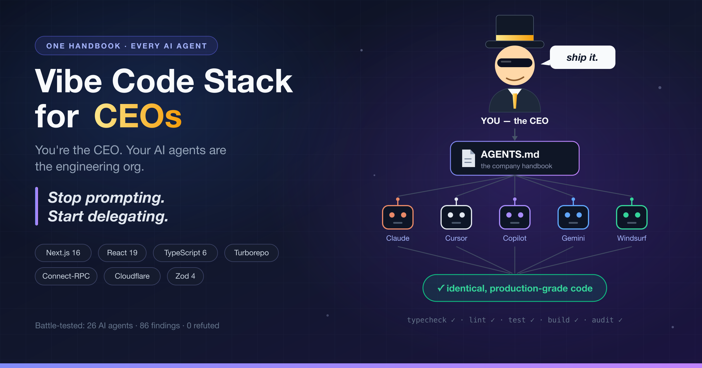

<div align="center">



<br />
<br />

# 🎩 Vibe Code Stack For CEOs

### You're the CEO. Your AI agents are the engineering org.

**Stop prompting. Start delegating.** The full-stack monorepo where Claude Code, Cursor, Gemini CLI, Kiro, Copilot, and Windsurf all read **one company handbook** — and ship **identical, production-grade code** on the first try.

[](https://github.com/NoahDuongMaster/vibe-code-stack-for-ceos/stargazers)
[](https://github.com/NoahDuongMaster/vibe-code-stack-for-ceos/network/members)
[](https://nextjs.org)
[](https://typescriptlang.org)
[](https://opensource.org/licenses/MIT)

[⚡ Quick Start](#-quick-start) · [😤 The Problem](#-the-problem) · [🏢 How It Works](#-how-it-works--the-ceo-model) · [🔥 Battle-Tested](#-battle-tested-by-26-ai-agents) · [⭐ Star History](#-star-history)

</div>

---

## 😤 The Problem

You open Cursor, type _"create a user profile page"_, and get:

- A file in the wrong folder
- `useState` for form fields instead of react-hook-form
- Raw `fetch()` instead of your HTTP client
- `console.log` everywhere
- No Zod validation, no error boundaries, no types

**You hired a 10x engineer and got an intern with amnesia.** Every prompt starts from zero. Every tool has its own opinions. You spend more time reviewing AI slop than you'd spend writing the code yourself.

That's not vibe coding. That's babysitting.

---

## 🏢 How It Works — the CEO Model

**A real company doesn't re-explain its culture to every new hire. It hands them the handbook.**

This repo has one: [`AGENTS.md`](./AGENTS.md) — the emerging open standard for agent instructions (`CLAUDE.md` is a symlink, so every tool finds it). It defines the architecture, the naming laws, the testing rules, the fireable offenses. Every AI agent reads it before writing a single line.

```
        ┌─────────────────────────────────┐
        │   AGENTS.md  (the handbook)     │
        │   CLAUDE.md ──► symlink         │
        └───────────────┬─────────────────┘
      ┌────────┬────────┼────────┬─────────┐
      ▼        ▼        ▼        ▼         ▼
   Claude   Cursor   Copilot  Gemini   Windsurf
      └────────┴────────┴────────┴─────────┘
                       ▼
        ✅ identical, rule-compliant code
```

And because trust is good but gates are better, **nothing ships without passing the Five Gates**:

> **`typecheck` → `lint` → `test` → `build` → `audit`** — enforced locally by husky, enforced again in CI, and deploys are CI-gated with staging/production separation. If an agent (or a human) breaks a rule, the pipeline says no. Period.

**You review outcomes, not syntax. That's the whole product.**

---

## 📊 Why Developers Are Switching

<table>
<tr>
<th width="250"></th>
<th width="150" align="center"><code>create-next-app</code></th>
<th width="150" align="center"><code>t3-app</code></th>
<th width="200" align="center"><b>🎩 Vibe Code Stack For CEOs</b></th>
</tr>
<tr>
<td><b>AI understands your architecture</b></td>
<td align="center">-</td>
<td align="center">-</td>
<td align="center">One <code>AGENTS.md</code>, every agent</td>
</tr>
<tr>
<td><b>Feature-Sliced Design v2.1</b></td>
<td align="center">-</td>
<td align="center">Partial</td>
<td align="center">Strict, Steiger + ESLint enforced</td>
</tr>
<tr>
<td><b>Full monorepo (3 apps + RPC backend)</b></td>
<td align="center">-</td>
<td align="center">-</td>
<td align="center">Turborepo, 8 workspaces</td>
</tr>
<tr>
<td><b>Type-safe end to end</b></td>
<td align="center">-</td>
<td align="center">tRPC</td>
<td align="center">Connect-RPC (Protobuf) + next-safe-action</td>
</tr>
<tr>
<td><b>CI-gated deploys (staging/prod)</b></td>
<td align="center">-</td>
<td align="center">-</td>
<td align="center">GitHub Environments + wrangler</td>
</tr>
<tr>
<td><b>Pre-commit AI code review</b></td>
<td align="center">-</td>
<td align="center">-</td>
<td align="center">Code Review Graph MCP</td>
</tr>
<tr>
<td><b>Headless, accessible UI</b></td>
<td align="center">-</td>
<td align="center">-</td>
<td align="center">Ark UI v5 (WAI-ARIA)</td>
</tr>
<tr>
<td><b>Security headers (CSP/HSTS/CORS)</b></td>
<td align="center">-</td>
<td align="center">-</td>
<td align="center">Nonce-based CSP, OWASP-ready</td>
</tr>
<tr>
<td><b>Audited by a fleet of AI agents</b></td>
<td align="center">-</td>
<td align="center">-</td>
<td align="center">26 agents, 86 findings, all fixed ✅</td>
</tr>
</table>

---

## 🔥 Battle-Tested by 26 AI Agents

Most boilerplates say "production-ready." We made 26 AI agents prove it.

We ran a **multi-agent production-readiness audit**: 10 specialist auditors tore through security, architecture, testing, CI/CD, performance, config, and dependencies in parallel — then every critical finding was handed to an **adversarial verifier agent** whose only job was to refute it against the real code.

**The result: 86 findings. 0 refuted. All 9 high-severity blockers fixed** — including a CSP nonce bug that would have broken production, a Turborepo cache flaw that could have shipped mock-auth to prod, and full backend CORS. Then the fix wave: 4 parallel agent teams, 300+ files touched, every gate re-run green.

```
✅ typecheck   8/8 workspaces
✅ biome       190 files, 0 errors
✅ eslint      6/6 workspaces
✅ tests       94/94 passing
✅ build       5/5 production builds
✅ audit       0 known vulnerabilities
```

This is what "your AI org follows the handbook" looks like in practice — the repo you're cloning was hardened by the same workflow it sells.

---

## 🎁 What You Get

### 🏛️ Architecture agents can't break

Frontend boundaries are executable, not just conventions. All three frontends
use canonical Feature-Sliced Design v2.1, checked by Steiger plus ESLint. The
dapp keeps Next's framework entrypoints thin and places application code under
the FSD root:

```
apps/dapp/
  app/              Next pages/layout/Route Handlers — delegation only
  proxy.ts          Next proxy entrypoint
  src/
    _app/           App routes, providers, metadata, errors, proxy, styles
    _pages/         Complete screens (api/model/ui)
    features/       Reusable user interactions such as sign-in
    entities/       Session domain API and model
    shared/         API client, config, focused libraries, routes, UI kit
```

- Imports point downward only: `_app → _pages → widgets → features → entities → shared`
- Same-layer slices are isolated; every slice/segment has a Public API
- Segment names describe purpose (`api`, `model`, `ui`, `config`), not file type
- Optional layers stay absent until they add value — dapp has no `widgets` yet
- `_app`/`_pages` avoid collisions with Next's root App and legacy Pages routers
- Components never call `fetch()`; same-slice API modules use the Shared client

### 🌍 A real company, not a toy app

|     | Workspace              | Stack                                                                           | Deploys to         |
| --- | ---------------------- | ------------------------------------------------------------------------------- | ------------------ |
| 🛍️  | `apps/dapp`            | Next.js 16 App Router on vinext (Vite)                                          | Cloudflare Workers |
| 🛠️  | `apps/admin`           | React 19 SPA — Rsbuild, route-split, code-split                                 | Cloudflare Pages   |
| 🪧  | `apps/landing`         | Astro — ships **literally zero JS**                                             | Cloudflare Workers |
| ⚙️  | `services/trading-rpc` | Nest/Fastify hybrid — Connect + gRPC, PostgreSQL 18, `/healthz`                  | Docker             |
| 🌐  | `services/api-gateway` | Edge gateway Worker — CORS allowlist, upstream proxy                            | Cloudflare Workers |
| 📜  | `packages/protocol`    | Protobuf schemas, buf lint + breaking-change gate in CI                         | —                  |
| 🧠  | `packages/api-core`    | One RPC implementation, two runtimes (Node + edge)                              | —                  |
| 🔌  | `packages/api-client`  | End-to-end typed browser client                                                 | —                  |

### 🔐 Security that survived an adversarial audit

- Nonce-based CSP wired the way Next.js actually requires (on the _request_ headers — most tutorials get this wrong)
- iron-session encrypted cookies + cryptographic session validation in middleware
- Zod at every trust boundary; constant-time credential comparison; login rate limiting
- Static CSP via `_headers` for admin/landing; allowlist-driven CORS across the backend
- Boot-time kill switch: production **refuses to start** with placeholder secrets

### 🚦 The Five Gates, everywhere

Husky pre-commit → CI (`typecheck`, `check:ci`, `lint`, `test`, `build`) → CI-gated deploys (`develop` → staging, `main` → production behind manual approval) → release-please automates versioning per workspace. Nobody deploys from a laptop. Nothing skips the gates.

<details>
<summary><b>🤖 Pre-commit AI Code Review (Code Review Graph MCP)</b></summary>

Every commit triggers a **semantic impact analysis** powered by a Tree-sitter knowledge graph:

- Detects which functions, components, and modules are affected
- Scores risk level of changes
- Flags architectural violations before they reach PR review
- Provides blast radius visualization

This isn't linting — it's structural understanding of your codebase.

</details>

---

## 🧰 Full-Stack Tech

<table>
<tr><td><b>Framework</b></td><td>Next.js 16 (App Router) on vinext (Vite)</td></tr>
<tr><td><b>Language</b></td><td>TypeScript 6 (strict mode)</td></tr>
<tr><td><b>Styling</b></td><td>Panda CSS + Ark UI v5 (headless, WAI-ARIA)</td></tr>
<tr><td><b>Server State</b></td><td>TanStack Query v5</td></tr>
<tr><td><b>Client State</b></td><td>Zustand v5 + nuqs (URL state)</td></tr>
<tr><td><b>Forms</b></td><td>react-hook-form + Zod v4</td></tr>
<tr><td><b>Server Actions</b></td><td>next-safe-action v8 (end-to-end typed)</td></tr>
<tr><td><b>Tables</b></td><td>TanStack Table v8</td></tr>
<tr><td><b>HTTP</b></td><td>ofetch via shared <code>xhr</code> client (dapp) · Connect-RPC client (admin)</td></tr>
<tr><td><b>Auth</b></td><td>iron-session v8 (encrypted cookies)</td></tr>
<tr><td><b>Animations</b></td><td>Motion (Framer Motion v12)</td></tr>
<tr><td><b>Testing</b></td><td>Vitest v4 + Testing Library + MSW v2 + Playwright</td></tr>
<tr><td><b>Linting</b></td><td>Biome v2 + ESLint (architectural rules) + buf lint</td></tr>
<tr><td><b>Monitoring</b></td><td>Sentry — client/server/edge on dapp, DSN-gated on every app + trading-rpc</td></tr>
<tr><td><b>Monorepo</b></td><td>Turborepo + pnpm workspaces (strict env allowlists, cached gates)</td></tr>
<tr><td><b>Backend API</b></td><td>Connect RPC (Protobuf/buf) — one core, two runtimes (Workers + Node)</td></tr>
<tr><td><b>Database</b></td><td>PostgreSQL 18 + Drizzle ORM/Kit over a bounded node-postgres pool</td></tr>
<tr><td><b>CI/CD</b></td><td>GitHub Actions — Five Gates + CodeQL + Playwright + Dependabot + release-please + CI-gated deploys</td></tr>
<tr><td><b>Containers</b></td><td>Docker definitions centralized in <code>infra/docker</code> (multi-stage, non-root)</td></tr>
</table>

---

## ⚡ Quick Start

Install and activate [mise](https://mise.jdx.dev/installing-mise.html) first.
Mise is the repository's supported toolchain and command interface. pnpm stays
under the hood for dependency resolution and workspace execution.

```bash
# Clone
git clone https://github.com/NoahDuongMaster/vibe-code-stack-for-ceos.git
cd vibe-code-stack-for-ceos

# Install the locked Node.js/pnpm toolchain and frozen dependencies
mise setup

# Start the whole company
mise dev

# …or one department
mise dev:web        # Next.js app      → http://localhost:3000
mise dev:admin      # React admin SPA
mise dev:landing    # Astro landing
mise dev:api        # Connect-RPC Node backend
mise dev:gateway    # Gateway → real development VPC → trading-rpc
mise dev:backend    # Gateway VPC mode + direct local trading-rpc process
```

### Development gateway → trading-rpc through Workers VPC

Start the Docker origin and Tunnel, then run the Worker locally with its remote
development binding:

```bash
make start-vpc-development
mise dev:gateway

# In a second terminal
curl -sS -X POST http://127.0.0.1:8787/trading.v1.TradingService/GetMarkets \
  -H 'content-type: application/json' \
  -H 'connect-protocol-version: 1' \
  --data '{"coinIds":["bitcoin","ethereum"],"vsCurrency":"usd"}'
```

`mise dev:gateway` selects `env.development` from `wrangler.jsonc`; Worker code
runs locally while `TRADING_RPC.fetch()` executes through Cloudflare's remote
VPC binding. The binding is mandatory in every environment; the gateway fails
closed when it is absent and never falls back to a direct URL.
The development VPC Service targets the network-scoped Docker alias
`trading-rpc.internal:3001`; override it before startup with
`TRADING_RPC_PRIVATE_HOSTNAME` when an environment needs a different internal
DNS suffix.

`trading-rpc` keeps Connect on HTTP/1.1 port `3001` inside its container.
Native Nest gRPC listens separately on `127.0.0.1:50051`. For a
reliable CoinGecko quota, add a free Demo key as `COINGECKO_API_KEY` in
`services/trading-rpc/.env`: the Node service owns the `TradingService` use
case and its CoinGecko adapter, while the gateway only proxies the Connect
request. Staging and production require isolated `TRADING_RPC` VPC Service IDs
before those environments can proxy this capability.

Then point your AI tool of choice at the repo. It reads [`AGENTS.md`](./AGENTS.md) and behaves. That's it — that's the onboarding.

<details>
<summary><b>🐳 Docker environments</b></summary>

`infra/docker` is the single source of truth for container builds. Development
uses one shared non-root workspace image for the Cloudflare-native apps, the
dedicated `trading-rpc` image, the official PostgreSQL 18 image, and
`cloudflare/cloudflared:latest`. Every build uses the repo root as its context.

```bash
# Development: five apps + PostgreSQL + cloudflared
make start-development

# Development: one app/service plus its declared dependencies
make start-dapp-development
make start-admin-development
make start-landing-development
make start-api-gateway-development
make start-trading-rpc-development

# Follow or stop the complete development stack
make logs-development
make stop-development

# Staging      → http://localhost:3002
docker compose -f infra/docker/compose.yaml -f infra/docker/compose.staging.yaml up --build

# Production   → http://localhost:80
docker compose -f infra/docker/compose.yaml -f infra/docker/compose.prod.yaml up --build
```

Development exposes dapp on `3000`, admin on `3002`, landing on `4321`, the
gateway on `8787`, trading-rpc Connect on `3003`, and native gRPC on `50051`.
PostgreSQL is available only on loopback port `5433` and persists through the
named `postgres-data` volume.
The trading-rpc capability owns its Drizzle schema and generated migration
journal. Use `pnpm --filter @services/trading-rpc db:generate` after changing
the schema and `pnpm --filter @services/trading-rpc db:migrate` to migrate a
configured database outside normal service bootstrap.
It requires the rotated tunnel token at
`infra/docker/secrets/cloudflare-tunnel-token`; see
[`infra/docker/README.md`](./infra/docker/README.md). Use
`make start-staging|start-production` for the other environments and
`make check-docker` after configuration changes. Staging expects
`apps/dapp/.env.staging`; production expects
`apps/dapp/.env.production.local`. Both are git-ignored and required at runtime.

</details>

<details>
<summary><b>🔑 Environment variables</b></summary>

Declared in `apps/dapp/src/shared/config/env.ts` with Zod validation. Never use `process.env` directly. Copy `apps/dapp/.env.sample` to get started.

| Variable                         | Required                  | Description                                                                                                                                   |
| -------------------------------- | ------------------------- | --------------------------------------------------------------------------------------------------------------------------------------------- |
| `NEXT_PUBLIC_PROJECT_NAME`       | Yes                       | App / project display name                                                                                                                    |
| `NEXT_PUBLIC_BASE_URL`           | Yes                       | Public base URL (must be a valid URL)                                                                                                         |
| `SESSION_SECRET`                 | Yes                       | iron-session secret (32+ chars)                                                                                                               |
| `DEMO_AUTH_EMAIL`                | Yes                       | Login email for the built-in demo auth flow (`src/features/sign-in/model/verify-credentials.server.ts`) — the server refuses to boot without it |
| `DEMO_AUTH_PASSWORD`             | Yes                       | Login password for the built-in demo auth flow — refuses to boot without it, and refuses to boot in production if left as a known placeholder |
| `NEXT_PUBLIC_API_ENDPOINT`       | Optional                  | Backend API base URL                                                                                                                          |
| `NEXT_PUBLIC_CORS_COOKIE`        | Optional                  | Cookie domain for CORS                                                                                                                        |
| `NEXT_PUBLIC_SENTRY_DSN`         | Optional                  | Sentry DSN (blank disables Sentry)                                                                                                            |
| `CORS_ORIGINS` / `CORS_RESOURCE` | Optional                  | Server-only CORS allowlists                                                                                                                   |
| `SENTRY_ORG` / `SENTRY_PROJECT`  | Optional, build-time only | Enables the Sentry plugin in `next.config.ts` — set as GitHub Environment `vars` in `deploy.yml`, not in `.env`                               |
| `SENTRY_AUTH_TOKEN`              | Optional, build-time only | Required alongside the two above to upload source maps — set as a GitHub Environment secret                                                   |

</details>

---

## 📜 All Scripts

| Command (repo root)                                                                  | What it does                                                |
| ------------------------------------------------------------------------------------ | ----------------------------------------------------------- |
| `mise setup`                                                                         | Install the locked toolchain and frozen dependencies         |
| `mise dev`                                                                           | Start every app through Turborepo                            |
| `mise dev:web` / `dev:admin` / `dev:landing` / `dev:api` / `dev:gateway`             | Start one workspace                                         |
| `mise dev:backend`                                                                   | Start the local gateway and trading-rpc together             |
| `mise build`                                                                         | Build every workspace                                       |
| `mise typecheck`                                                                     | Run TypeScript checks across all workspaces                  |
| `mise lint`                                                                          | Run ESLint, Biome, buf, and architecture checks              |
| `mise check` / `check:ci` / `format`                                                 | Apply Biome fixes / run the read-only gate / format files    |
| `mise test`                                                                          | Run toolchain and workspace unit tests                       |
| `mise test:e2e`                                                                      | Run dapp Playwright tests                                    |
| `mise verify`                                                                        | Run every definition-of-done gate sequentially               |
| `mise docker:start` / `docker:stop` / `docker:check`                                 | Operate or validate the Docker development environment       |

Use direct pnpm only for targeted workspace commands that have no mise task.
Deployment remains GitHub Actions-only.

---

## 🗂️ Project Structure

```
.
├── apps/
│   ├── dapp/                     Next.js 16 app (vinext) — canonical FSD v2.1
│   ├── admin/                    React 19 admin SPA — canonical FSD v2.1
│   └── landing/                  Astro marketing site (zero JS)
├── packages/
│   ├── protocol/                 Protobuf/Connect contracts (buf codegen → src/gen)
│   ├── api-core/                 Runtime-agnostic Connect service + CORS-aware fetch handler
│   └── api-client/               End-to-end typed Connect RPC client
├── services/
│   ├── api-gateway/              Connect RPC on Cloudflare Workers (edge + upstream proxy)
│   └── trading-rpc/              Connect RPC on Node.js (tsup build, /healthz)
├── infra/docker/                All Dockerfiles + shared Compose/environment overlays
├── AGENTS.md                     ★ The company handbook — every AI agent reads this
├── CLAUDE.md                     → symlink to AGENTS.md
├── turbo.json                    Turborepo task pipeline
└── pnpm-workspace.yaml           Workspaces + dependency overrides
```

---

## 🤝 Contributing

1. Fork the repo
2. Create a branch: `feat(scope)/short-description` (Conventional Commits, lowercase kebab)
3. Follow the handbook: [`AGENTS.md`](AGENTS.md)
4. Pass the gates: `mise verify`
5. Open a PR

Yes — your AI agent can do all five steps. That's the point. 🎩

---

## ⭐ Star History

<a href="https://www.star-history.com/?repos=NoahDuongMaster%2Fvibe-code-stack-for-ceos&type=timeline&legend=bottom-right">
 <picture>
   <source media="(prefers-color-scheme: dark)" srcset="https://api.star-history.com/chart?repos=NoahDuongMaster/vibe-code-stack-for-ceos&type=timeline&theme=dark&legend=bottom-right&sealed_token=U0Y0K_7mYErU2kz0IMdf9gMUibGZY5NcIWTNI4YG4SsV6S7Z5dznwGbyqlq1UUIZ5blhjBZjtvj3bFK7fDpwjHTP4iyTyICcU-rP-BaQ2aeBVFS8NWV-LYdTm3FAKX-f3OG8CvkA931EwxYcdsB2rh3NyCEMnGKsudTcYcWLl9nfsTTvcrNwkuHI1lik" />
   <source media="(prefers-color-scheme: light)" srcset="https://api.star-history.com/chart?repos=NoahDuongMaster/vibe-code-stack-for-ceos&type=timeline&legend=bottom-right&sealed_token=U0Y0K_7mYErU2kz0IMdf9gMUibGZY5NcIWTNI4YG4SsV6S7Z5dznwGbyqlq1UUIZ5blhjBZjtvj3bFK7fDpwjHTP4iyTyICcU-rP-BaQ2aeBVFS8NWV-LYdTm3FAKX-f3OG8CvkA931EwxYcdsB2rh3NyCEMnGKsudTcYcWLl9nfsTTvcrNwkuHI1lik" />
   
 </picture>
</a>

---

<div align="center">

### 🎩 Run your code like a company. Ship like a CEO.

**If this saved you time, [star the repo](https://github.com/NoahDuongMaster/vibe-code-stack-for-ceos) — it helps other CEOs find their handbook.**

Built by [Noah Duong](https://github.com/NoahDuongMaster) · MIT License

<a href="https://buymeacoffee.com/truongdn"></a>
<a href="https://github.com/sponsors/truongdn-it"></a>

</div>
